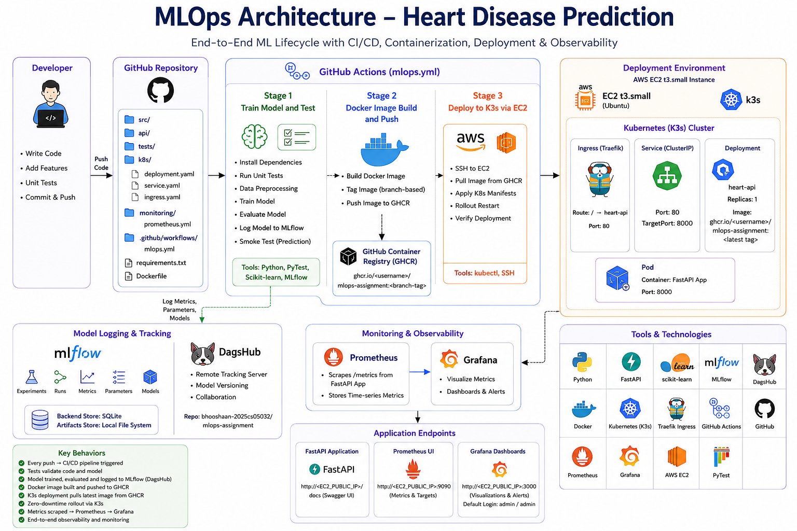

# MLOps Assignment – Heart Disease Prediction

An end-to-end MLOps pipeline for heart disease prediction, covering data processing, model training, experiment tracking, containerization, CI/CD automation, Kubernetes deployment, and observability.

## Report

[Assignment Report (PDF)](Assignment%20Report.pdf)

## Demo Recording

[Watch the demo recording](https://drive.google.com/file/d/1waLydlMx2iI6unlLuzCD0gHqu7y6XuNH/view?usp=sharing)

## Architecture

## Overview

- **Model**: Scikit-learn classifier trained on the Heart Disease dataset
- **Experiment Tracking**: MLflow with DagsHub as the remote tracking server
- **API**: FastAPI application exposing a `/predict` endpoint (Swagger UI at `/docs`)
- **Containerization**: Docker image built and pushed to GitHub Container Registry (GHCR)
- **CI/CD**: GitHub Actions (`mlops.yml`) with three stages:
  1. Train, evaluate, and smoke-test the model
  2. Build and push the Docker image to GHCR
  3. Deploy to a Kubernetes (K3s) cluster on AWS EC2 via SSH
- **Kubernetes**: K3s on an AWS EC2 t3.small instance with Traefik Ingress, ClusterIP Service, and a single-replica Deployment
- **Monitoring**: Prometheus scrapes metrics from the FastAPI app; Grafana visualises them with dashboards and alerts

## Key Behaviours

- Every push to the repository triggers the full CI/CD pipeline
- Tests validate code and model quality before any deployment
- The trained model is logged to MLflow (DagsHub) with parameters and metrics
- A Docker image is built, tagged with the branch name, and pushed to GHCR
- K3s pulls the latest image from GHCR and performs a zero-downtime rollout restart
- Prometheus → Grafana provides end-to-end observability

## Application Endpoints (after deployment)

| Service              | URL                                           |
| -------------------- | --------------------------------------------- |
| FastAPI (Swagger UI) | `http://<EC2_PUBLIC_IP>/docs`                 |
| Prometheus UI        | `http://<EC2_PUBLIC_IP>:9090`                 |
| Grafana Dashboards   | `http://<EC2_PUBLIC_IP>:3000` (admin / admin) |

## Tech Stack

Python · FastAPI · Scikit-learn · MLflow · DagsHub · Docker · Kubernetes (K3s) · Traefik · GitHub Actions · Prometheus · Grafana · AWS EC2 · PyTest
